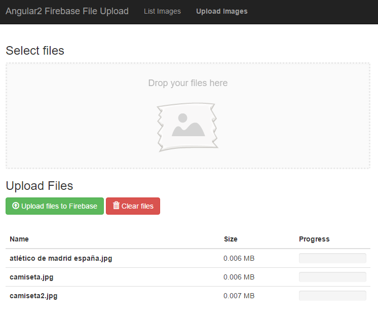

# UploadFirebase - Project description

This project is an Angular2 demo to show how to use Firebase Storage to upload images in Firebase and how to use Firebase Realtime Database to see in real time the files that are uploaded.

## Screenshots

**Upload files:**

**List files:**

## Download and run the application
- If you have not installed angular-cli, you have to install it: `npm install angular-cli --save`
- Clone this repo and enter inside the folder
- run `npm install`
- run `ng serve`

## Live demo

You can see this project running in **Firebase Hosting** in this URL: [https://upload-582a4.firebaseapp.com/](https://upload-582a4.firebaseapp.com/)

If you want to see working the **Firebase Realtime Database** then you can open two different browsers, one with the **List Images** page and the other one with the **Upload Images** page. Then you will see that when you upload images they will be displayed automatically in the **list images** page.
